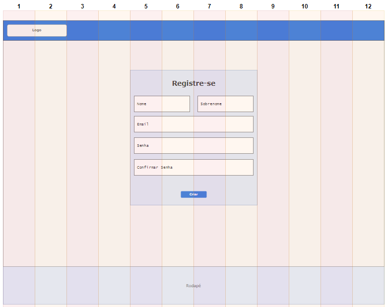

# Informações do Projeto
## Monitor de Glicose 

`Ciência da Computação`

## Participantes
* Caio de Andrade Franco
* Henrique Azevedo Flores
* Marco Aurélio de Noronha Santos
* Paula de Freitas Camargos
* Thales Matheus Mendonça Santos

# Estrutura do Documento

- [Informações do Projeto](#informações-do-projeto)
  - [Participantes](#participantes)
- [Estrutura do Documento](#estrutura-do-documento)
- [Introdução](#introdução)
  - [Problema](#problema)
  - [Objetivos](#objetivos)
  - [Justificativa](#justificativa)
  - [Público-Alvo](#público-alvo)
- [Especificações do Projeto](#especificações-do-projeto)
  - [Personas e Mapas de Empatia](#personas-e-mapas-de-empatia)
  - [Histórias de Usuários](#histórias-de-usuários)
  - [Requisitos](#requisitos)
    - [Requisitos Funcionais](#requisitos-funcionais)
    - [Requisitos não Funcionais](#requisitos-não-funcionais)
  - [Restrições](#restrições)
- [Projeto de Interface](#projeto-de-interface)
  - [User Flow](#user-flow)
  - [Wireframes](#wireframes)
- [Metodologia](#metodologia)
  - [Divisão de Papéis](#divisão-de-papéis)
  - [Ferramentas](#ferramentas)
  - [Controle de Versão](#controle-de-versão)
- [**############## SPRINT 1 ACABA AQUI #############**](#-sprint-1-acaba-aqui-)
- [Projeto da Solução](#projeto-da-solução)
  - [Tecnologias Utilizadas](#tecnologias-utilizadas)
  - [Arquitetura da solução](#arquitetura-da-solução)
- [Avaliação da Aplicação](#avaliação-da-aplicação)
  - [Plano de Testes](#plano-de-testes)
  - [Ferramentas de Testes (Opcional)](#ferramentas-de-testes-opcional)
  - [Registros de Testes](#registros-de-testes)
- [Referências](#referências)

# Introdução

A crescente mudança de hábitos de vida da população atual (como: estilo de vida sedentário, maior ingestão de calorias e comidas processadas) interfere diretamente no sistema metabólico, elevando a propensão de um indivíduo a doenças crônicas. Dentre elas, está o Diabetes Mellitus, doença foco do presente trabalho.  

O Diabetes Mellitus (DM) é uma síndrome do metabolismo decorrente da não produção de insulina ou, em caso de produção, da incapacidade de empregá-la adequadamente; existindo quatro tipos: Tipo 1, Tipo 2, Gestacional e Pré-Diabetes. É uma doença que, atualmente, atinge cerca de 3% da população mundial, com perspectiva de aumento nos próximos anos.  

Para o controle da doença, e evitar que haja complicações (como: Cetoacidose diabética e/ou Neuropatia diabética), recomenda-se acompanhamento periódico com um profissional e medição dos níveis glicêmicos.

## Problema

No Brasil atual, estima-se que 10% da população sofra dessa síndrome, e que aproximadamente 75% dos portadores não controlem a doença de forma adequada, seja pela rejeição à aplicação diária de injeções de insulina ou rejeição a agulhas no geral, ou até mesmo falta de informações abordadas sem termos técnicos, com uma linguagem facilmente compreensível. 

Idealmente, os problemas imediatos que o projeto tem intenção de resolver são: a dificuldade em aderir às recomendações médicas, dificuldade no próprio acompanhamento médico e no acompanhamento da glicemia, não só pelo portador da doença como, também, pelos familiares e/ou cuidadores e, por fim, a falta de informações objetivas destinadas ao grande público com linguagem de fácil entendimento.

## Objetivos

O objetivo geral do presente projeto é fornecer um software com interface interativa destinado a portadores do Diabetes, independentemente do tipo. 
 
Em especificidade, podemos citar:  

- Fornecer informações cadastradas no perfil de um usuário em um formato de fácil entendimento para o profissional responsável; 
- Permitir interação dos usuários com artigos informativos em forma de comentários, curtidas e favoritos;  
- Possibilitar o registro rápido e fácil de informações relevantes ao acompanhamento;
- Disponibilizar  informações educativas ao paciente;

## Justificativa

A alta prevalência de Diabetes Mellitus associada a baixa adesão às recomendações terapêuticas está estatisticamente relacionada ao risco de doenças cardiovasculares graves, como infarto e acidente vascular encefálico, além de maior índice de internações e perda de anos potenciais e produtivos de vida.

Um dos pontos principais do manejo dessa doença é a monitoração dos níveis de glicose, particularmente nos pacientes que fazem uso de insulina, que são exatamente os quais estão sob o maior risco de desenvolvimento de complicações a curto, médio e longo prazo.

Algumas iniciativas bem documentadas já mostraram impactos positivos de plataformas digitais nesses indivíduos como, por exemplo, o uso de ferramentas de redes sociais voltadas a portadores da doença. Data a ubiquidade de dispositivos digitais, outras iniciativas podem ser exploradas objetivando abordar outros aspectos.

Considerando esses aspectos, facilitar a adesão às recomendações terapêuticas através do monitoramento glicêmico por meio de uma plataforma web pode ter um grande impacto positivo na saúde desses indivíduos

## Público-Alvo

Essencialmente, o público alvo deste projeto serão pessoas que sofrem com o Diabetes, profissionais da saúde que os acompanham e os familiares dos portadores da doença.

Entre os principais subgrupos de pacientes, os portadores de Diabetes Mellitus tipo 1 e tipo 2, destacam-se as diferenças quanto à faixa etária, maior no segundo grupo, e necessidade de monitoramento intensivo de glicose sanguínea, maior no primeiro grupo.

O objetivo é que a plataforma tenha uma interface intuitiva, podendo ser utilizada tanto por pessoas mais novas quanto por indivíduos mais velhos. 
 
# Especificações do Projeto

A partir da caracterização do perfil dos usuários, representados através das personas e histórias de usuários abaixo, obtidos através de entrevistas com pacientes portadores de diabetes e com médicos, foi possível identificar os principais problemas a serem solucionados, bem como as funcionalidades que a plataforma deveria oferecer.

## Personas e Mapas de Empatia

As personas levantadas durante o processo de entendimento do problema são apresentadas na Figuras que se seguem.

### Persona Médico

## Histórias de Usuários

Com base na análise das personas forma identificadas as seguintes histórias de usuários:

|EU COMO...| QUERO/PRECISO...|PARA ...|
|---|---|---|
|Portador de diabetes | Meio prático de registrar glicemias e doses de insulina | Melhorar organização e acompanhamento, sem depender de meios físicos (papel/caderno)|
|Portador de diabetes | Ferramenta de controle de doses de medicações | Evitar esquecer doses das medicações |
|Portador de diabetes | De uma maneira de analisar o relatório mensal do histórico de glicemia| Facilitar acompanhamentodo com o médico |

## Requisitos

As tabelas que se seguem apresentam os requisitos funcionais e não funcionais que detalham o escopo do projeto.

### Requisitos Funcionais

|ID    |                        Descrição do Requisito                       | Prioridade |
|------|---------------------------------------------------------------------|------------|
|RF-001| Acesso via login                                                         | ALTA  |
|RF-002| Permitir que o usuário registre a hora e a medida da glicose no sangue   | ALTA  | 
|RF-003| Permitir que o usuário registre hora e quantidade da dosagem de insulina | MÉDIA |
|RF-004| Permitir o cadastro de diferentes medicamentos                           | MÉDIA |
|RF-005| Permitir que o usuário registre hora de uma refeição                     | MÉDIA |
|RF-006| Permitir a visualização gráfica de dados                                 | MÉDIA |
|RF-007| Permitir a exportação de dados                                           | MÉDIA |

### Requisitos não Funcionais

|ID     | Descrição do Requisito  |Prioridade |
|-------|-------------------------|----|
|RNF-001| O sistema deve ser responsivo para rodar em um dispositivos móvel | MÉDIA | 
|RNF-002| O sistema deve ser de fácil entendimento |  BAIXA | 
|RNF-003| Deve processar requisições do usuário em no máximo 3s |  BAIXA | 
|RNF-004| Proteção de acesso via usuário e senha |  BAIXA | 

## Restrições

O projeto está restrito pelos itens apresentados na tabela a seguir.

|ID| Restrição                                               |
|--|---------------------------------------------------------|
|01| O projeto deverá ser entregue até o final do semestre   |
|02| Não pode ser desenvolvido um módulo de backend          |
|03| A entrada de dados é exclusivamente manual.             |
|04| Plataforma restrita às tecnologias básicas de front end |

# Projeto de Interface

## User Flow

......  INCLUA AQUI O DIAGRAMA COM O FLUXO DO USUÁRIO NA APLICAÇÃO ......

> Fluxo de usuário (User Flow) é uma técnica que permite ao desenvolvedor
> mapear todo fluxo de telas do site ou app. Essa técnica funciona
> para alinhar os caminhos e as possíveis ações que o usuário pode
> fazer junto com os membros de sua equipe.
>
> **Links Úteis**:
> - [User Flow: O Quê É e Como Fazer?](https://medium.com/7bits/fluxo-de-usu%C3%A1rio-user-flow-o-que-%C3%A9-como-fazer-79d965872534)
> - [User Flow vs Site Maps](http://designr.com.br/sitemap-e-user-flow-quais-as-diferencas-e-quando-usar-cada-um/)
> - [Top 25 User Flow Tools & Templates for Smooth](https://www.mockplus.com/blog/post/user-flow-tools)
>
> **Exemplo**:

## Wireframes

### Tela de Registro

### Tela Login

### Tela Principal

# Metodologia

## Divisão de Papéis

| Nome                            | Função                      |
|---------------------------------|-----------------------------|
|Caio de Andrade Franco           |Documentação, desenvolvimento| 
|Henrique Azevedo Flores          |Documentação, desenvolvimento| 
|Marco Aurélio de Noronha Santos  |Documentação, desenvolvimento| 
|Paula de Freitas Camargos        |Documentação, desenvolvimento|
|Thales Matheus Mendonça          |Documentação, desenvolvimento| 

## Ferramentas

| Ambiente  | Plataforma              |Link de Acesso |
|-----------|-------------------------|---------------|
|Processo de Design Thinkgin  | Miro |  https://miro.com/app/board/uXjVPZ375T8=/ | 
|Repositório de código | GitHub | https://github.com/ICEI-PUC-Minas-PPLCC-TI/tiaw-ppl-cc-m-20222-grupo-monitorizacao-de-diabetes | 
|Hospedagem do site | Heroku |  https://dashboard.heroku.com/apps/grupo12tiaw | 
|Wireframe e user flow | draw.io| https://app.diagrams.net/ |
|Hospedagem temporária de documentos | Google Drive | https://drive.google.com/drive/folders/1tkVLEsdkhkbKqFvtycgNOotBzROSNDCn?usp=sharing |
|Editor de código | Visual Studio Code | https://code.visualstudio.com |
|Gerenciamento de projeto | Trello | https://trello.com |

## Controle de Versão

......  COLOQUE AQUI O SEU TEXTO ......

> Discuta como a configuração do projeto foi feita na ferramenta de
> versionamento escolhida. Exponha como a gerência de tags, merges,
> commits e branchs é realizada. Discuta como a gerência de issues foi
> realizada.
> A ferramenta de controle de versão adotada no projeto foi o
> [Git](https://git-scm.com/), sendo que o [Github](https://github.com)
> foi utilizado para hospedagem do repositório `upstream`.
> 
> O projeto segue a seguinte convenção para o nome de branchs:
> 
> - `master`: versão estável já testada do software
> - `unstable`: versão já testada do software, porém instável
> - `testing`: versão em testes do software
> - `dev`: versão de desenvolvimento do software
> 
> Quanto à gerência de issues, o projeto adota a seguinte convenção para
> etiquetas:
> 
> - `bugfix`: uma funcionalidade encontra-se com problemas
> - `enhancement`: uma funcionalidade precisa ser melhorada
> - `feature`: uma nova funcionalidade precisa ser introduzida
>
> **Links Úteis**:
> - [Tutorial GitHub](https://guides.github.com/activities/hello-world/)
> - [Git e Github](https://www.youtube.com/playlist?list=PLHz_AreHm4dm7ZULPAmadvNhH6vk9oNZA)
> - [5 Git Workflows & Branching Strategy to deliver better code](https://zepel.io/blog/5-git-workflows-to-improve-development/)
>
> **Exemplo - GitHub Feature Branch Workflow**:
>
> 

# **############## SPRINT 1 ACABA AQUI #############**

# Projeto da Solução

......  COLOQUE AQUI O SEU TEXTO ......

## Tecnologias Utilizadas

......  COLOQUE AQUI O SEU TEXTO ......

> Descreva aqui qual(is) tecnologias você vai usar para resolver o seu
> problema, ou seja, implementar a sua solução. Liste todas as
> tecnologias envolvidas, linguagens a serem utilizadas, serviços web,
> frameworks, bibliotecas, IDEs de desenvolvimento, e ferramentas.
> Apresente também uma figura explicando como as tecnologias estão
> relacionadas ou como uma interação do usuário com o sistema vai ser
> conduzida, por onde ela passa até retornar uma resposta ao usuário.
> 
> Inclua os diagramas de User Flow, esboços criados pelo grupo
> (stoyboards), além dos protótipos de telas (wireframes). Descreva cada
> item textualmente comentando e complementando o que está apresentado
> nas imagens.

## Arquitetura da solução

......  COLOQUE AQUI O SEU TEXTO E O DIAGRAMA DE ARQUITETURA .......

> Inclua um diagrama da solução e descreva os módulos e as tecnologias
> que fazem parte da solução. Discorra sobre o diagrama.
> 
> **Exemplo do diagrama de Arquitetura**:
> 
> 

# Avaliação da Aplicação

......  COLOQUE AQUI O SEU TEXTO ......

> Apresente os cenários de testes utilizados na realização dos testes da
> sua aplicação. Escolha cenários de testes que demonstrem os requisitos
> sendo satisfeitos.

## Plano de Testes

......  COLOQUE AQUI O SEU TEXTO ......

> Enumere quais cenários de testes foram selecionados para teste. Neste
> tópico o grupo deve detalhar quais funcionalidades avaliadas, o grupo
> de usuários que foi escolhido para participar do teste e as
> ferramentas utilizadas.
> 
> **Links Úteis**:
> - [IBM - Criação e Geração de Planos de Teste](https://www.ibm.com/developerworks/br/local/rational/criacao_geracao_planos_testes_software/index.html)
> - [Práticas e Técnicas de Testes Ágeis](http://assiste.serpro.gov.br/serproagil/Apresenta/slides.pdf)
> -  [Teste de Software: Conceitos e tipos de testes](https://blog.onedaytesting.com.br/teste-de-software/)

## Ferramentas de Testes (Opcional)

......  COLOQUE AQUI O SEU TEXTO ......

> Comente sobre as ferramentas de testes utilizadas.
> 
> **Links Úteis**:
> - [Ferramentas de Test para Java Script](https://geekflare.com/javascript-unit-testing/)
> - [UX Tools](https://uxdesign.cc/ux-user-research-and-user-testing-tools-2d339d379dc7)

## Registros de Testes

......  COLOQUE AQUI O SEU TEXTO ......

> Discorra sobre os resultados do teste. Ressaltando pontos fortes e
> fracos identificados na solução. Comente como o grupo pretende atacar
> esses pontos nas próximas iterações. Apresente as falhas detectadas e
> as melhorias geradas a partir dos resultados obtidos nos testes.

# Referências

......  COLOQUE AQUI O SEU TEXTO ......

> Inclua todas as referências (livros, artigos, sites, etc) utilizados
> no desenvolvimento do trabalho.
> 
> **Links Úteis**:
> - [Formato ABNT](https://www.normastecnicas.com/abnt/trabalhos-academicos/referencias/)
> - [Referências Bibliográficas da ABNT](https://comunidade.rockcontent.com/referencia-bibliografica-abnt/)